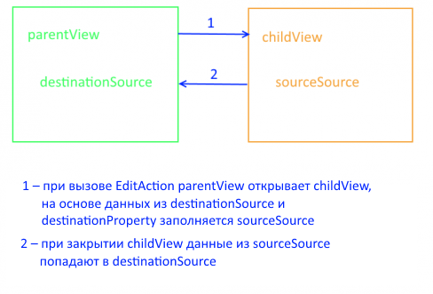

EditAction
==========

Редактирует элемент из `источника данных <../../DataSources>`__.

Extends
-------

`BaseAction <../BaseAction/>`__

Syntax
------

.. code:: js

    new EditAction(parentView)

Parameters
~~~~~~~~~~

.. list-table::
   :header-rows: 1

   * - Name
     - Type
     - Description
   * - parentView
     - `View <../../Elements/View/>`__
     -  Родительское представление 

Properties
----------

Для работы с данными свойствами используйте методы
`getProperty <../BaseAction/BaseAction.getProperty.html>`__ и
`setProperty <../BaseAction/BaseAction.setProperty.html>`__.

.. list-table::
   :header-rows: 1

   * - Name
     - Type
     - Description
   * - linkView
     - `LinkView <../../Elements/View/LinkView/>`__
     - Объект, который будет создавать и настраивать `представление <../../Elements/View/>`__ для редактирования элемента
   * - sourceSource
     - ``String``
     - Название редактируемого источника данных на представлении редактирования
   * - destinationSource
     - ``String``
     - Название редактируемого источника данных на представлении, откуда редактирование было вызвано
   * - destinationProperty
     - ``String``
     - Путь до поля в источнике данных, которое будет редактироваться

Examples
--------

.. code:: js

    var linkView = (new InlineViewBuilder()).build(null, {
                                                            builder: args.builder, 
                                                            metadata: {View: editPatientView}, 
                                                            parentView: parentView
                                                        });

    var editAction = new EditAction(parentView);

    editAction.setProperty('linkView', linkView);
    editAction.setProperty('sourceSource', 'MainDataSource');
    editAction.setProperty('destinationSource', 'Patients');
    editAction.setProperty('destinationProperty', '$');

    editAction.execute(); // откроется форма редактирования текущего пациента

See Also
--------

-  `AddAction <../AddAction/>`__
-  `DeleteAction <../DeleteAction/>`__
-  `getProperty <../BaseAction/BaseAction.getProperty.html>`__
-  `setProperty <../BaseAction/BaseAction.setProperty.html>`__

.. toctree::
   :hidden:

   EditAction.metadata.rst
