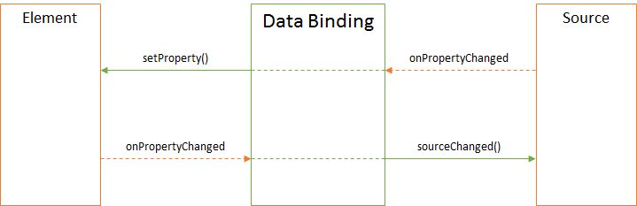

DataBinding
===========

Data binding is a linking between elements and sources.

Description
-----------

Data binding allows synchronize property values of two different objects. One is conditionally called element while another is source. Elements are often 
`representations of <../Elements/>`__ `visual view <../Elements/View/>`__ while sources are - `data sources <../DataSources/>`__. Typically that doesn't matter which element will be the element and wich be the source because both represent the same interface. Objects that can bind data are all types of `visual elements <../Elements/>`__, all types of
`Data Sources <../DataSources/>`__ and `View Parameters <../Parameters/>`__.

Any data binding can be representd as non-visual programm object which can define the data conversion rules <BindingConverter/>`__ for both element and source, as well as desirable 
`direction of data streams in binding mode <BindingMode/>`__:

-  Bi-directional exchange between element and source - if source has got updates then element gets updated otherwise if element has got updates then element gets updated accordingly.
-  To source updates - if source has got updates then no change to element is done, otherwise if element has got updates then source gets updated.
-  To element update -  if source has got updates element gets updated otherwise source gets no update.

Data binding thus conceals complexity of synchronizing between elements and sources and simplifies the code to great extent and makes behaviour of all elements controllable .

Syntax
------

.. code:: js

    new DataBinding()

Parameters
~~~~~~~~~~
No

Returns
~~~~~~~

DataBinding

Usage
-----

.. code:: js

    //js-demo
    var element = new TextBox();
    var $element = element.render();
    element.setLabelText("Element");

    var source = new TextBox();
    var $source = source.render();
    source.setLabelText("Source");

    var binding = new DataBinding();
    binding.setMode('ToSource');
    binding.bindSource(source, 'value');
    binding.bindElement(element, 'value');

    $elementForExample.append($element);
    $elementForExample.append($source);

Methods
-------

.. list-table::
   :header-rows: 1

   * - Name
     - Description
   * - `getMode <DataBinding.getMode.html>`__
     - Returns `direction of data stream in binding mode <BindingMode/>`__
   * - `setMode <DataBinding.setMode.html>`__
     - Sets `direction of data stream in binding mode <BindingMode/>`__
   * - `getConverter <DataBinding.getConverter.html>`__
     - Returns `data converter between element and source <BindingConverter/>`__
   * - `setConverter <DataBinding.setConverter.html>`__
     - Sets `data converter between element and source <BindingConverter/>`__
   * - `bindSource <DataBinding.bindSource.html>`__
     - Sets binding to source
   * - `getSource <DataBinding.getSource.html>`__
     - Returns data source binding
   * - `getSourceProperty <DataBinding.getSourceProperty.html>`__
     - Returns path to data source property binding 
   * - `bindElement <DataBinding.bindElement.html>`__
     - Sets binding to element
   * - `getElement <DataBinding.getElement.html>`__
     - Returns element binding
   * - `getElementProperty <DataBinding.getElementProperty.html>`__
     - returns path to element binding property
   * - `getDefaultValue <DataBinding.getDefaultValue.html>`__
     - Returns element defaul value
   * - `setDefaultValue <DataBinding.setDefaultValue.html>`__
     - Sets default value for element

Events
------

No

.. toctree::
   :hidden:

   BindingConverter/index.rst
   BindingMode/index.rst
   DataBinding.bindElement.rst
   DataBinding.bindSource.rst
   DataBinding.getConverter.rst
   DataBinding.getDefaultValue.rst
   DataBinding.getElement.rst
   DataBinding.getElementProperty.rst
   DataBinding.getMode.rst
   DataBinding.getSource.rst
   DataBinding.getSourceProperty.rst
   DataBinding.metadata.rst
   DataBinding.setConverter.rst
   DataBinding.setDefaultValue.rst
   DataBinding.setMode.rst

.. include:: DataBinding.metadata.rst
