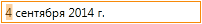

DateTimeEditMask
================

Маска ввода даты/времени.

|image0|
|image1|
|image2|

Маска должна записываться в формате, который описан в разделе
`DateTimeFormatting <../../Localizations/Localizations.dateTimeFormatting.html>`__.

Поведение маски ввода:

-  Нажатие клавиши "пробел" выделяет следующий раздел маски, который
   можно редактировать.
-  Ввод разделителя даты выделяет следующий раздел маски по
   редактированию даты.
-  Ввод разделителя времени выделяет следующий раздел маски по
   редактированию времени.
-  Нажатие клавиш ``↑`` и ``↓`` увеличивает или уменьшает в допустимых
   диапазонах выделенный раздел маски (год, месяц, день, час, минута,
   секунда, половина суток).

Properties
----------

.. list-table::
   :header-rows: 1

   * - Name
     - Type
     - Description
   * - Mask
     - ``String``
     - Маска редактирования

Examples
--------

.. code:: json

    {
        "DateTimeEditMask": {
            "Mask": "d"
        }
    }

.. code:: json

    {
        "DateTimeEditMask": {
            "Mask": "d MMMM yyyy"
        }
    }

.. code:: js

    //js-demo

    var metadata = {
        TextBox: {
            EditMask: {
                DateTimeEditMask: {
                    Mask: "dd MM yyyy"
                }
            },
            DisplayFormat: {
                DateTimeFormat: {
                    Format: "dd MMMM yyyy"
                }
            }
        }
    };

    var builder = new InfinniUI.ApplicationBuilder();
    var textbox = builder.build(metadata);

    //  Render
    $elementForExample.append(textbox.render());

.. |image1| image:: ../assets/DateTimeEditMask_Ex_01.png
.. |image2| image:: ../assets/DateTimeEditMask_Ex_02.png

