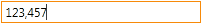
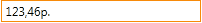
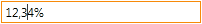

NumberEditMask
==============

Маска ввода числового значения.

.. list-table::
   :header-rows: 1

   * - image0
   * - image1
   * - image2

Маска должна записываться в формате, который описан в разделе
`NumberFormatting <../../Culture/Culture.numberFormatting.html>`__.

Поведение маски ввода:

-  Нажатие клавиши ``-`` меняет знак редактируемого значения, не меняя
   значения каретки, где бы она не находилась.
-  Нажатие клавиш ``↑`` и ``↓`` увеличивает или уменьшает на 1 значение
   цифры слева от каретки.

Properties
----------

.. list-table::
   :header-rows: 1

   * - Name
     - Type
     - Description
   * - Mask
     - ``String``
     - Маска редактирования

Examples
--------

.. code:: json

    {
        "NumberEditMask": {
            "Mask": "n3"
         }
    }

.. code:: json

    {
        "NumberEditMask": {
            "Mask": "c3"
         }
    }

.. code:: js

    //js-demo

    var metadata = {
        TextBox: {
            EditMask: {
                NumberEditMask: {
                    Mask: "c3"
                }
            },
            DisplayFormat: {
                NumberFormat: {
                    Format: "c3"
                }
            }
        }
    };

    var builder = new ApplicationBuilder();
    var textbox = builder.build(metadata);

    //  Render
    $elementForExample.append(textbox.render());

