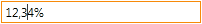

EditMask
========

Edit mask is implemented in case if a user should enter data in strictly-defind format. Mask shall only be appled in input mode, to display data use `DisplayFormat <../DisplayFormat/>`__ .  Editor using a mask gets into input mode provides text field which allows to enter data only pre-defined by mask. For example, input field can only accept 24-hours format time, integer numbers or phone number.

Edit Mask types
----------------

Base properies of Edit Mask data can be read in article BaseEditMask,
below listed base Edit Mask types.

`DateTimeEditMask <DateTimeEditMask/>`__

Editor allows enter date/time in a particular format.

|image0|
|image1|
|image2|

Mask simplifies date/time input in certain format especially when it comes to keboard input. It can use a few pre-defined most freuently used date/time templates. In addition to that, it is possible to define a specific format string for date/time input including year, month, day, hour, minute, seconds etc.

`NumberEditMask <NumberEditMask/>`__

Editor allows to input numeric values only in certain format.

|image3|
|image4|
|image5|

Mask significantly eases keyboard input of numeric values in certain format eg integer, fractional number, currency, percent etc. A few pre-defined most frequently used templates can be used in addition to specific format string.

`TemplateEditMask <TemplateEditMask/>`__

Editor allows to input fix format string.

|image6|
|image7|

Mask supports symbols which define simple rules of input.
For example, one can define a rule that phone number must start with a 3-digit code.
Special symbols and literals can be dispayed in input mode while can be bypassed in edit mode eg dashes in phone numbers can be added automatically. Unlike regular expressions mask is simple and helps to auto-fill data.

.. |image0| image:: assets/DateTimeEditMask_Ex_00.png
.. |image1| image:: assets/DateTimeEditMask_Ex_01.png

.. |image3| image:: assets/NumericEditMask_Ex_00.png
.. |image4| image:: assets/NumericEditMask_Ex_01.png

.. |image6| image:: assets/TemplateEditMask_Ex_00.png
.. |image7| image:: assets/TemplateEditMask_Ex_01.png

.. toctree::
   :hidden:

   DateTimeEditMask/index.rst
   NumberEditMask/index.rst
   TemplateEditMask/index.rst
