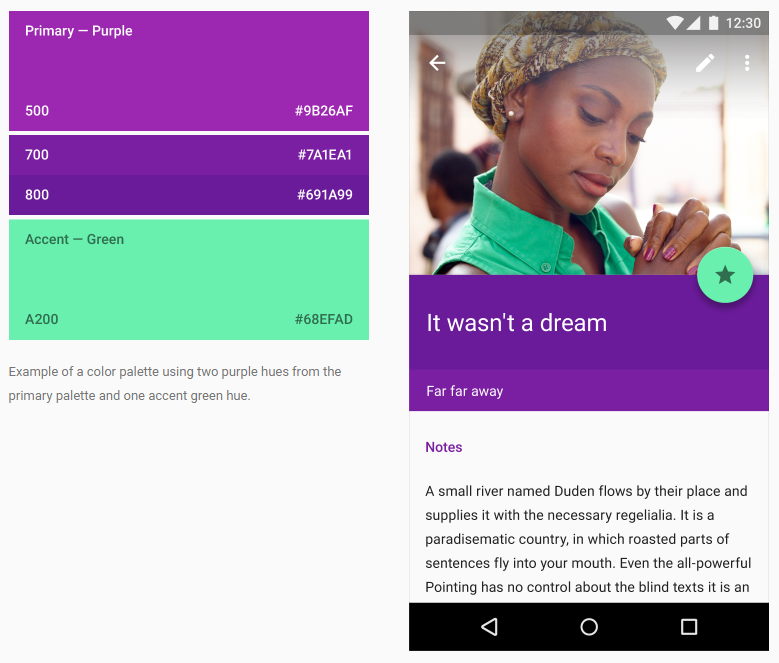

ColorStyle
==========

Стиль цвета.

Description
-----------

Описываемые здесь способы задания цвета могут применяться для установки
цвета элементов и цвета текста в InfinniUI. Цвета могут быть заданы
одним из предопределенных значений цвета.

Implementation
~~~~~~~~~~~~~~

Цветовые стили включают в себя прозрачность (``transparent``), три
основных цвета (``primary1``, ``primary2``, ``primary3``), три акцентных
цвета (``accent1``, ``accent2``, ``accent3``), белый (``white``) и
черный (``black``). Так же, есть 3 цвета фона (``background1``,
``background2``, ``background3``).

Syntax
------

.. code:: js

    ColorStyle = {
      transparent: 'Transparent', // Прозрачный
      primary1: 'Primary1',       // Основной цвет 1
      primary2: 'Primary2',       // Основной цвет 2
      primary3: 'Primary3',       // Основной цвет 3
      accent1: 'Accent1',         // Акцентный цвет 1
      accent2: 'Accent2',         // Акцентный цвет 2
      accent3: 'Accent3',         // Акцентный цвет 3
      background1: 'Background1', // Цвет фона 1
      background2: 'Background2', // Цвет фона 2
      background3: 'Background3', // Цвет фона 3
      background4: "Background4", // Цвет фона 4
      white: 'White',             // Белый цвет
      black: 'Black'              // Черный цвет
    }

Examples
--------

See Also
--------

-  `TextStyle <../TextStyle>`__
