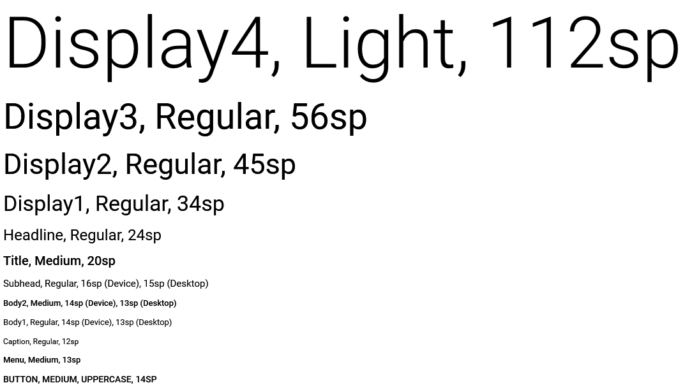

TextStyle
=========

Стиль текста.

Description
-----------

Стиль текста определяет шрифт (Font Family), размер (Font Size) и
насыщенность (Font Weight) выводимого на экран текста. InfinniUI
предоставляет набор предопределенных текстовых стилей. Каждый из
отдельных элементов этого набора можно настроить на свое усмотрение, а в
конечном проекте настраивать стиль текста, применяя тот или иной элемент
из набора.

Syntax
------

.. code:: js

    TextStyle = {
      display4: 'Display4',
      display3: 'Display3',
      display2: 'Display2',
      display1: 'Display1',
      headline: 'Headline',
      title: 'Title',
      subhead: 'Subhead',
      body2: 'Body2',
      body1: 'Body1',
      caption: 'Caption',
      menu: 'Menu',
      button: 'Button'
    }

Examples
--------

See Also
--------

-  `ColorStyle <../ColorStyle>`__
